# Time-Series Analysis
## Univariate Time Series Forecasting with ARIMA
### Author : Isuru De Zoysa

**Table of Contents**

1.	Introduction
2.	Understanding Time Series
3.	What is ARIMA?
4.	Step-by-Step ARIMA Implementation
5.	Practical Example
	
**Introduction**

Forecasting based on time series data plays a significant role in decision-making processes and economic analysis. ARIMA is one of the most impactful and emerging techniques for predicting time series data. Throughout this guide, you’ll learn all you need about ARIMA modelling.

**Understanding Time Series**

**Time series** data is a set of data points captured at equal intervals: daily, monthly, or even year. This kind of data is used in many disciplines, such as economics, finance, environmental science, or social science since it facilitates the investigation of the behavior of processes and phenomena over time. 

**Time Series** forecasting uses statistical models to estimate future values of a time series from its past data. Forecasting a time series is often of tremendous commercial value.

**Forecasting a time series can be divided into two categories**,
1.	Univariate time series forecasting 
Univariate time series forecasting is the process of forecasting the future values of a single variable using its past data and for instance, forecasting future stock prices from past stock prices. 
2.	Multivariate time series forecasting
Multivariate time series forecasting is the process of predicting future values based on multiple interconnected time-dependent variables.  This method captures the complex relationships and interdependencies among various factors, leading to more accurate predictions. For example, business organizations could examine several economic factors, consumer spending, and seasons to aid in predicting sales.

**Time Series Components**
Studying time series components is significant before modelling as they interpret patterns and trends in time-dependent data. The various uses each component showcases come in as an advantage since every one of them takes a different way of looking at the behavior of the data over time, hence enabling one to analyze, calculate, forecast, and make decisions based on references to past trends and fluctuations of the data. Four main time series components can be identified as,

1.	**Trend Component**
   
The trend component of the time series data shows the long-term direction, whether it’s increasing, decreasing, or remaining stable over time.
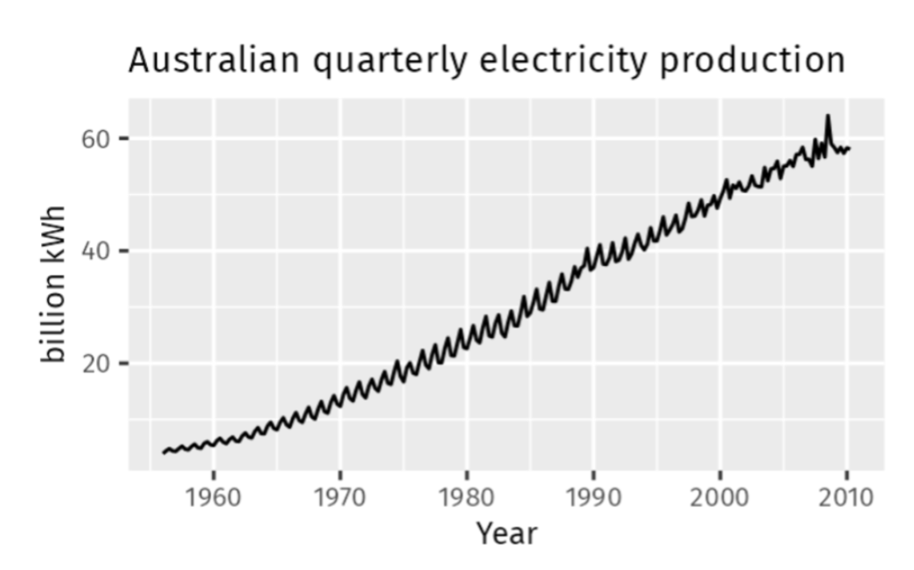

   Figure 01 : Australian quarterly electricity production.

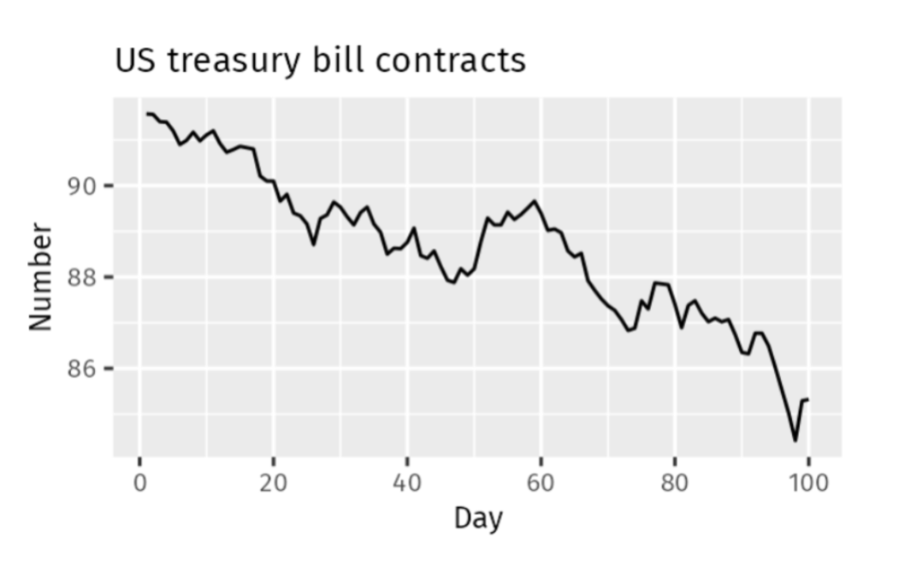

   Figure 02 : US treasury bill contracts.

It is useful to capture the overall increase or decrease; for instance, the frequency of healthcare consultations in a given period is useful in defining plans, establishing medium—and long-term targets, and forecasting future trends.

2.	**Seasonal Component**
   
Seasonality represents the recurring, predictable patterns within specific time intervals (e.g., hours, days, months, or quarters). Seasonality is always of a fixed and known frequency.
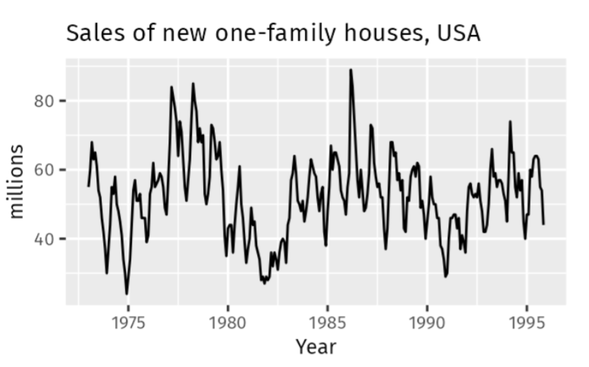

  
Figure 03 : Sales of one-family houses in the USA.

The seasonality of time series data provides insight into periodic influences, like higher retail sales during holiday seasons or increased patient visits during flu season. This helps organizations adjust resources, inventory, or staffing to match predictable demand cycles.

3.	**Cyclical Component**
   
A cyclical pattern does not have a fixed pattern like a seasonal component. However, it captures the long-term patterns of the time series data often influenced by external or economic factors.

	
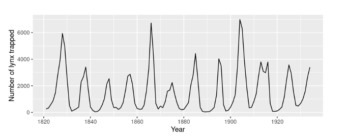

	
	

  
Figure 04 : Number of lynx trapped.

It is most beneficial when applied to patterns that result from business cycles, variations in economic conditions, or other alterations in consumer behaviour.

4. **Irregular (or Noise) Component.**

This component represents the random, unpredictable variations that are not explained by trend, seasonal, or cyclical patterns. It’s the "noise" in the data, often due to unexpected events.

	
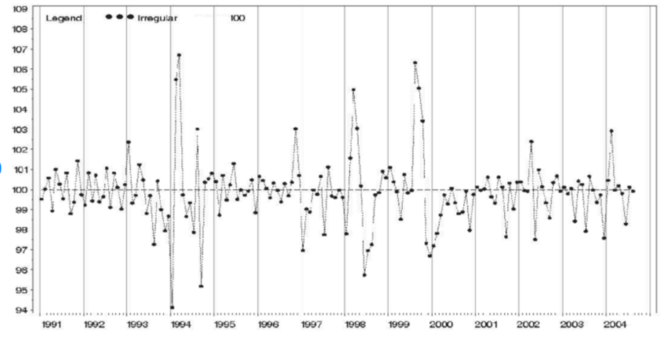

	
	

  
Figure 05 : Sales by Canadian Department Stores.

*Description:* Displays the irregular component of Sales by Canadian Department Stores, which comprises extreme values, namely in 1994, 1998, 1999, and Jan 2000. Most of these outliers have to do with the closure of some department stores and the entry of a large department store in the Canadian market.

It helps to identify outliers, such as sudden drops or spikes in data due to unusual events (e.g., natural disasters, economic crises), and by isolating irregular components, the process of cleaning data and preprocessing data is easier, which helps to make forecasts more accurate.

**Why Understanding Time Series Components is Crucial:**

1.	*Improve the forecasting:* Leveraging individual patterns in the time series data is the best practice for accurate prediction. 
2.	*Understand the Insight of Data:* Understanding each component helps plan responses to predictable patterns (seasonal demand), detect trend shifts, and make informed strategic decisions.
3.	*Anomaly Detection:* Understanding what’s expected (e.g., trend and seasonality), deviations from these patterns are more noticeable, making it easier to detect and investigate anomalies.

Now that we know the basic foundation of time series data, the main target of this article is to model it using the ARIMA model. Let’s examine ARIMA modeling step by step.

**What is ARIMA?**

ARIMA stands for AutoRegressive Integrated Moving Average, a commonly used statistical model that captures the underlying trends and patterns in time series data due to its versatility and effectiveness.
ARIMA consists of three components:

1.	*AR (Autoregressive): (p)*- refers to using the past values of the variable to predict future values. 
2.	*I (Integrated): (d)* - refers to removing the trend or seasonality from the time series data to make it stationary. 
3.	*MA (Moving Average): (q)* - refers to the average of the past errors in the prediction of the variable.

**ARIMA Model and Parameters**

$$ y_t' = c + \phi_1 y_{t-1}' + \dots + \phi_p y_{t-p}' + \theta_1 \epsilon_{t-1} + \dots + \theta_q \epsilon_{t-q} + \epsilon_t $$

Where, 
$$y_t'$$: Current value  

$$c$$: Constant(Intercept)

$$\phi_1 y_{t-1}'$$: AR coefficients($$i$$=1 from $$p$$)

$$\theta_1$$: MA coefficients($$i$$=1 from $$q$$)

$$\epsilon_{t-1}$$: Error term at time t

$$y'_{t-p} $$: Past values(lags)

$$\epsilon_{t-q}$$: Past errors

$$p$$: Order of autoregression 

$$d$$: Degree of differencing 

$$q$$: Order of moving average

**Step-by-step Implementation**

	
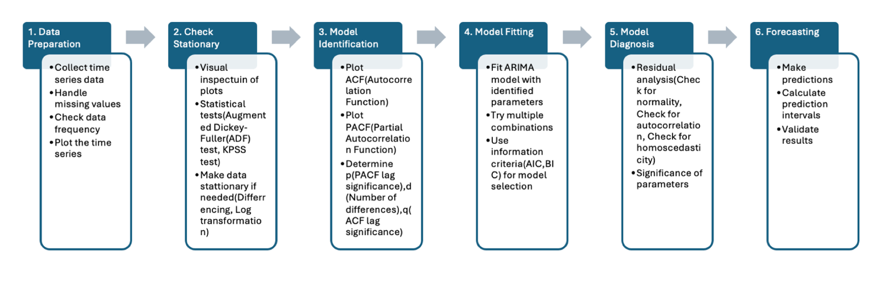

	
	

  
Diagram 01 : Flow chart of developing ARIMA model.

**Practical Example**

**Dataset Description**

The selected dataset provides a snapshot of monthly shampoo sales spanning seventeen years, from 07/01/1991 to 06/01/2008. Each observation is a sales count. The genesis of this dataset is attributed to ‘AG Hair Company’ in Canada.

The first step of any time series analysis is to plot the data.

	
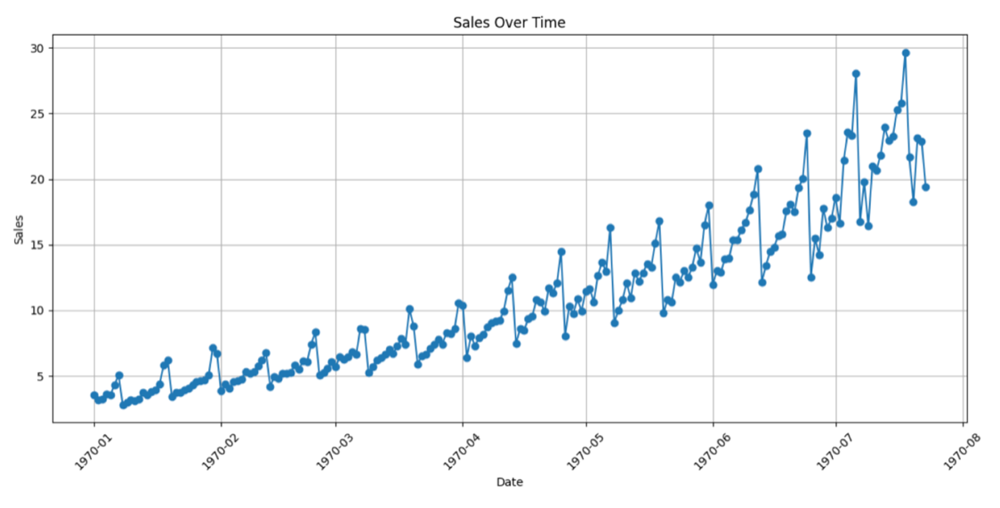

	
	

  
Figure 06: Time series plot of sales data.

The time series plot illustrates the sales trend over the observed period. There appears to be a general upward trend in sales, although with some fluctuations. Also, according to the time series plot, sales data is not stationary concerning mean and variance.

The second step is to check the stationary of the data series, the results of the ADF test are as follows,

| Order| ADF test Probability |
|-----------------|----------------|
| Original series| 1.0000  |
| 1st| 0.117| 
| 2st | <0.001| 

Table 01 : Summarized ADF test results

The ADF test hypothesis is,

**H0** : Data series is stationary

**H1** : Data series is not stationary

According to the results of the ADF test, the second-order series is stationary. Then we can confirm the value of d as 2.

One parameter of the ARIMA model is found already. Then, the task is to find the rest of the parameters(p and q).  To find the parameter p, the AR component, the **Partial Autocorrelation (PACF)** plot is used.

	
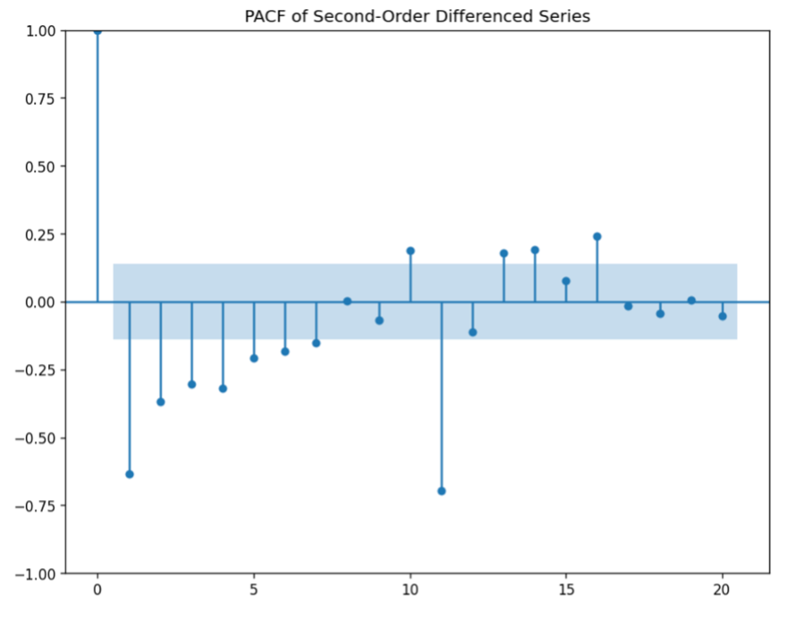

	
	

  
Figure 07: PACF of second-differenced sales data.

According to the PACF, spikes of 1, 2, 3, 4,5, and 6 extended beyond the significant confidence interval, hence, the possible values for p are 1,2,3,4,5,6.

In the next step, the MA component, q, can be identified via an **Autocorrelation Function (ACF)** plot.

	
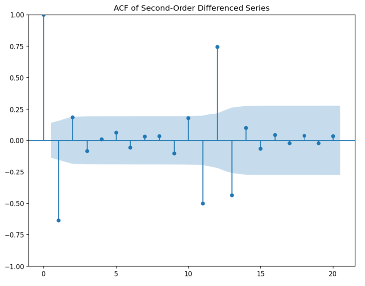

	
	

  
Figure 08: ACF of second-differenced sales data.

According to the ACF, 1, 11, 12 and 13 spikes are significant. When we consider the non-seasonal q values, then, q=1. 11th, 12th, and 13th significant spikes are related to seasonality. So, we might consider using a Seasonal ARIMA (SARIMA) model. Here, I considered only the non-seasonal ARIMA.

After finding the parameters of the ARIMA model, the final ARIMA model can be fitted.

	
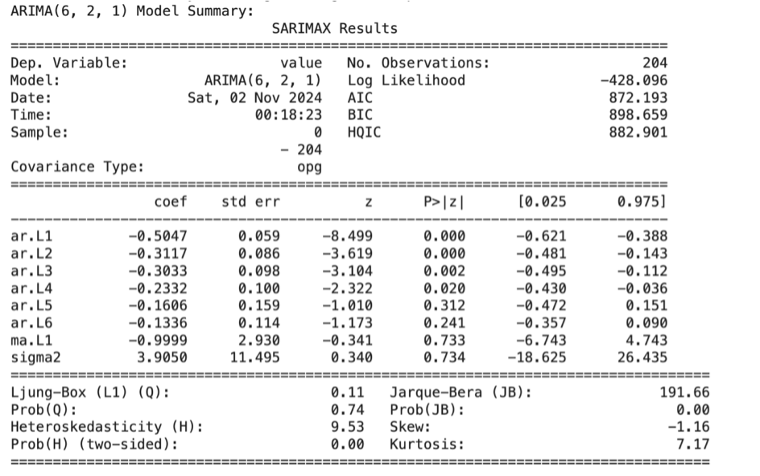

	
	

  
Figure 09: Fitted ARIMA model.

According to the results, the best model for the data set is ARIMA(6, 2, 1). Because it has a lower AIC. According to the results, coefficients of AR(1,2,3,4)are statistically significant. 

**H0**: The coefficient is not statistically significant

**H1** : The coefficient is statistically significant.

Then, the ARIMA model is fitted with significant parameters.

	
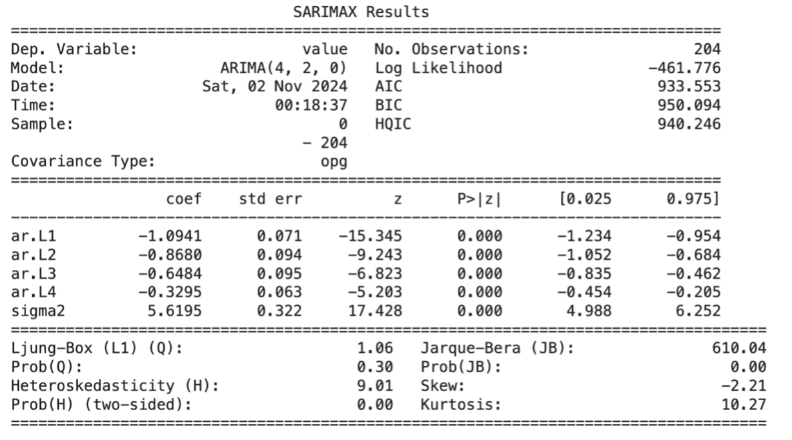

	
	

  
Figure 10: Improved ARIMA model.

Finally, we can check the accuracy of the model via the plots of residuals and the actual vs fitted values.

	
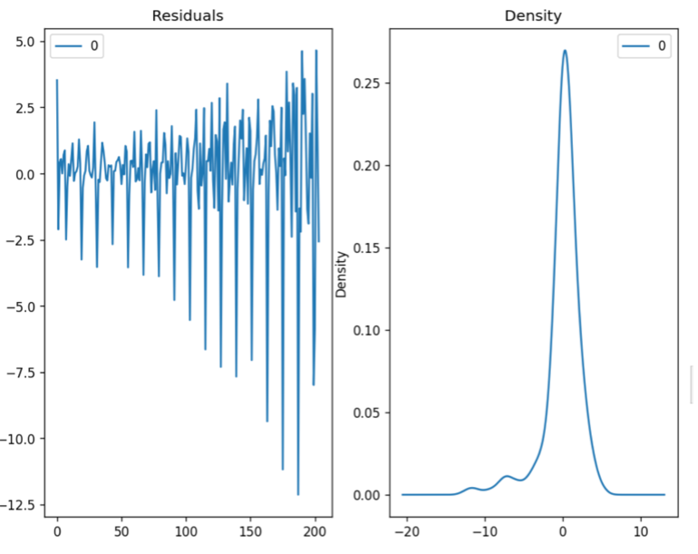

	
	

  
Figure 11: Residual plot of the ARIMA model.

The residual errors seem fine with near zero mean and uniform variance.

	
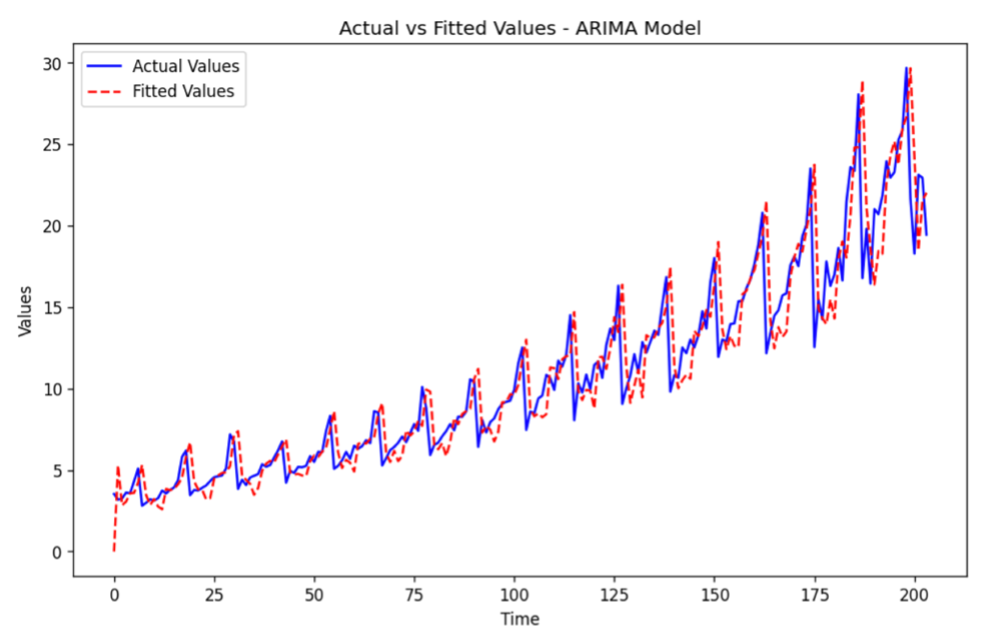

	
	

  
Figure 12: Actual vs fitted values of the ARIMA model.

So, we seem to have a decent ARIMA model because both graphs are tallied perfectly. But, we can’t say that this is the best ARIMA model because we haven’t forecasted the future and compared the forecast with the actual performance.

So, the real validation can be done by cross-validation.

	
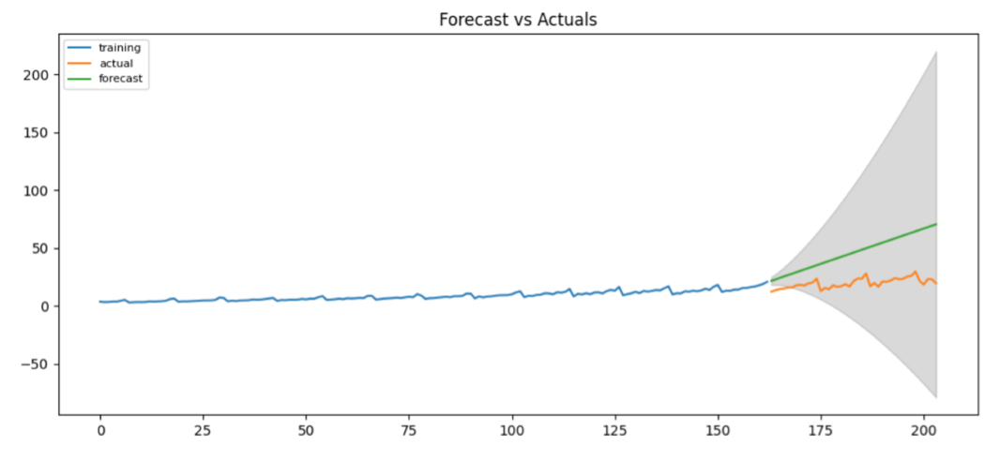

	
	

  
Figure 13: Forecast vs actual values of fitted ARIMA model.

From the above chart, the ARIMA(4,2,0) model seems to predict a correct forecast. The actual observed values lie within the 95% confidence band.

## References

1. Estela Bee Dagum. *Time Series Modelling and Decomposition*.(https://www.researchgate.net/figure/displays-the-irregular-component-of-Sales-by-Canadian-Department-Stores-which-comprises_fig3_307663962)
2. Ryan Hung and Sandra Lee. *Analyzing the Effectiveness of COVID-19 Mitigation Policies Using ARIMA Forecasting.*  (https://www.researchgate.net/publication/369293929_Analyzing_the_Effectiveness_of_COVID-19_Mitigation_Policies_Using_ARIMA_Forecasting)
3. *Quickonomics*.(https://quickonomics.com/terms/time-series-data/)
4. *Geeksforgeeks*.(https://www.geeksforgeeks.org/univariate-time-series-analysis-and-forecasting/, https://www.geeksforgeeks.org/multivariate-time-series-forecasting-with-lstms-in-keras/)
5. *Rob J Hyndman and George Athanasopoulos*. (https://otexts.com/fpp2/tspatterns.html)
   

  

